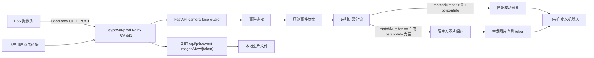

# 摄像头人脸识别事件推送到飞书 LLD

## 1. 文档状态

- 文档类型：LLD。
- 依据文档：`docs/camera-alarm-feishu-push-plan.html`。
- 日期：2026-07-02。
- 目标环境：`qypower-prod`，公网 IP `82.156.198.180`。
- 实现约束：关键方案已确认，后续代码实现、部署脚本调整和远程服务器初始化必须按本文档执行。

## 2. 设计目标

### 2.1 一期目标

- 摄像头通过 P6SEvent HTTP V2 主动推送 `FaceReco` 事件到远程服务器。
- 匹配成功时，每个独立识别事件都向飞书机器人发送匹配到的人员姓名、人员 ID、摄像头、识别时间和事件 ID。
- 未匹配成功时，服务器保存陌生人抓拍图到按日期创建的目录，并向飞书机器人发送保存路径和可点击查看链接。
- 图片查看链接必须由服务器受控提供，不能直接暴露服务器真实文件路径。
- 服务部署在 `qypower-prod`，通过 Nginx 反代到 FastAPI。
- 首版不依赖数据库，使用文件系统保存原始事件、图片、处理记录和链接记录。

### 2.2 非目标

- 不在本阶段重写摄像头管理后台 UI。
- 不在本阶段实现完整人脸库管理新流程。
- 不在本阶段强制接入飞书应用图片上传能力；首版使用富文本链接闭环。
- 不在文档、git 或 `.env.example` 写入真实飞书 webhook、秘钥、摄像头密码或其他密钥。
- 不直接把服务器磁盘路径作为可点击 URL 暴露给公网。

## 3. 现状对齐与关键决策

### 3.1 当前仓库现状

当前仓库已经是一个 FastAPI 摄像头管理服务：

- `app/main.py`：FastAPI 入口，挂载 `/api` 和静态页面。
- `app/routers/camera.py`：摄像头管理 API、P6S 事件回调、抓拍保存。
- `app/services/p6s_camera.py`：P6S 摄像头 HTTP API 封装。
- `app/services/feishu.py`：飞书通知与图片上传封装。
- `scripts/qypower-camera.service`：systemd 模板。
- `scripts/qypower-nginx.conf`：Nginx 模板。
- `DEPLOY.md`：当前部署说明。

### 3.2 路径与服务名决策

技术方案中曾使用 `camera-event-bridge`、`/api/camera-events/p6s`、`/camera-events/images/{token}` 作为概念路径。LLD 阶段为了减少迁移风险，首版实现优先沿用当前项目已有路径：

- 应用目录：`/opt/camera-face-guard`。
- 环境变量文件：`/etc/camera-face-guard/app.env`。
- 图片与事件根目录：`/var/lib/camera-face-guard/p6s_events`。
- systemd 服务：`camera-face-guard.service`。
- 摄像头事件入口：`POST /api/p6s/events/{P6S_EVENT_SECRET}`。
- 图片查看入口：新增 `GET /api/p6s/event-images/view/{token}`。

对外兼容路径可在 Nginx 层后续增加：

- `/api/camera-events/p6s` 可反代或重写到 `/api/p6s/events/{secret}`。
- `/camera-events/images/{token}` 可反代或重写到 `/api/p6s/event-images/view/{token}`。

首版不强制增加兼容路径，避免摄像头和服务端鉴权设计同时变复杂。

### 3.3 当前实现差距

当前代码已经能接收 `FaceReco`、保存陌生人图片、发送飞书陌生人通知，但与目标仍有差距：

- 当前只在 `personInfo` 为空时处理陌生人，没有发送匹配成功通知。
- 当前只读取 `info.personInfo`，而文档中的 `personInfo` 可能在顶层或 `info` 下，需要兼容。
- 当前图片目录是扁平结构，需要改为按日期目录保存。
- 当前 `GET /api/p6s/event-images/{filename}` 按文件名公开图片，需要改为 token 化查看链接。
- 当前飞书 webhook 没有实现签名秘钥 `FEISHU_WEBHOOK_SECRET`。
- 当前飞书通知主要是文本和可选内嵌图片，缺少富文本链接模板。
- 当前事件处理逻辑集中在 `app/routers/camera.py`，需要拆分到服务模块，降低路由复杂度。

### 3.4 已确认决策

以下结论已由用户确认，后续实现不得擅自变更：

- 首版沿用当前 `camera-face-guard` FastAPI 服务，不新增独立的 `camera-event-bridge` 服务。
- 事件入口使用 `POST /api/p6s/events/{P6S_EVENT_SECRET}`。
- 图片查看入口使用 `GET /api/p6s/event-images/view/{token}`，飞书消息不再使用按文件名直接访问图片的旧接口。
- 首版公网链路先使用 `http://82.156.198.180`，后续再升级域名和 HTTPS。
- 匹配成功必须每次通知：只要是不同的独立 `FaceReco` 匹配成功事件，即使识别到同一个人，也都发送飞书通知。
- 去重只用于同一个事件的缓存重放、网络重试或重复投递，不能按人员 ID、人员姓名或短时间窗口压制不同事件。
- 陌生人图片查看 token 默认有效期为 `86400` 秒。
- 陌生人原图和事件记录默认保留 `30` 天。
- 首版不引入数据库，全部使用文件系统保存原始事件、处理记录、图片和 token 映射。
- 首版不依赖飞书内嵌图片能力，以富文本消息中的可点击图片链接完成闭环。

## 4. 总体架构



## 5. 模块边界

### 5.1 `app/routers/camera.py`

职责：

- 保留摄像头管理后台相关 API。
- 提供 P6S 事件回调入口。
- 提供图片 token 查看入口。
- 只做 HTTP 层参数读取、错误转换和响应返回。

需要调整：

- `_handle_p6s_event` 只负责调用服务层，不直接解析和处理业务。
- 新增 `GET /p6s/event-images/view/{token}`。
- 生产环境下废弃或保护现有 `GET /p6s/event-images/{filename}`。

### 5.2 新增 `app/services/p6s_events.py`

职责：

- 标准化 P6S 事件 payload。
- 生成 dedupe key。
- 判断事件类型。
- 解析 `FaceReco` 的匹配结果。
- 调用图片保存、链接生成和飞书通知。
- 生成 P6S Ack。

建议暴露函数：

```python
async def handle_event(
    payload: dict[str, Any],
    request_meta: EventRequestMeta,
) -> EventHandleResult:
    ...
```

### 5.3 新增 `app/services/event_store.py`

职责：

- 保存原始事件 JSON。
- 保存结构化处理记录。
- 原子写入文件，避免并发写坏。
- 根据 dedupe key 查询是否已处理。
- 记录飞书发送状态。

首版使用文件系统，不引入数据库。

### 5.4 新增 `app/services/image_links.py`

职责：

- 为陌生人图片生成短期有效 token。
- 保存 token 到图片记录的映射。
- 校验 token、过期时间和文件存在性。
- 返回可被 `FileResponse` 使用的图片路径和 MIME 类型。

首版使用不透明随机 token，不把真实文件路径编码进 URL。

### 5.5 调整 `app/services/feishu.py`

职责：

- 读取飞书 webhook、签名秘钥和可选应用凭证。
- 支持自定义机器人签名校验。
- 支持发送富文本 `post` 消息。
- 保留可选图片上传和图片消息能力。

需要调整：

- `FeishuConfig` 增加 `webhook_secret`。
- 新增 `send_post(title, lines)`。
- 新增 `notify_known_face(...)`。
- 调整 `notify_unknown_face(...)`，支持保存路径和查看链接。
- webhook 请求体大小必须控制在 20 KB 内。

### 5.6 `app/services/p6s_camera.py`

职责不变：

- 摄像头管理、Owner、人脸库、人员图片上传。

本链路可能新增能力：

- 如果真机事件不携带图片，而只携带摄像头图片记录 ID，再扩展摄像头图片拉取方法。
- 该能力必须基于真机样本或 P6S 文档确认后再实现。

## 6. 外部接口设计

### 6.1 摄像头事件入口

首版沿用当前入口：

```http
POST /api/p6s/events/{path_secret}
Content-Type: application/json
```

鉴权规则：

- 如果 `P6S_EVENT_SECRET` 为空：仅允许本地开发，不建议远程使用。
- 如果 `P6S_EVENT_SECRET` 不为空：必须满足以下任一方式。
- 路径：`/api/p6s/events/{P6S_EVENT_SECRET}`。
- 查询参数：`/api/p6s/events?secret={P6S_EVENT_SECRET}`。
- 请求头：`X-P6S-Event-Secret: {P6S_EVENT_SECRET}`。

摄像头联调建议：

```text
Host=82.156.198.180
Port=80
URLPath=/api/p6s/events/<P6S_EVENT_SECRET>
Protocol=http
AuthMode=none
CacheEventEnable=true
```

成功响应：

- `heartbeat` 返回 `heartbeat-Ack`。
- `FaceReco` 返回 `FaceReco-Ack`。
- 其他事件返回 `{operator}-Ack`。

错误响应：

- 鉴权失败：`403`，不处理事件。
- JSON 格式错误：`400`，不处理事件。
- 事件持久化失败：`500`，让摄像头重试。
- 飞书发送失败：不影响摄像头 Ack，错误写入处理记录。

### 6.2 图片查看入口

新增：

```http
GET /api/p6s/event-images/view/{token}
```

规则：

- `token` 必须存在于 link store。
- `token` 未过期。
- 映射的图片路径必须在 `P6S_EVENT_IMAGE_DIR` 下，禁止路径穿越。
- 文件必须存在，且 MIME 类型必须是 `image/jpeg` 或 `image/png`。
- 成功时返回图片二进制。

响应：

- 成功：`200`，`Content-Type: image/jpeg` 或 `image/png`。
- token 不存在：`404`。
- token 过期：`410`。
- 文件丢失：`404`。
- 路径非法：`403`。

当前旧入口：

```http
GET /api/p6s/event-images/{filename}
```

生产要求：

- 不再作为飞书消息链接使用。
- 后续实现时应删除、改为管理员登录后可访问，或仅保留本地排障用途。

### 6.3 管理后台状态接口

现有：

```http
GET /api/camera/status
```

需要补充返回：

```json
{
  "events": {
    "dir": "/var/lib/camera-face-guard/p6s_events",
    "has_secret": true,
    "public_base_url": "http://82.156.198.180",
    "image_link_ttl_seconds": 86400,
    "notify_known_person": true,
    "signed_image_links": true
  },
  "feishu": {
    "has_webhook": true,
    "has_webhook_secret": true,
    "has_app_id": false,
    "has_app_secret": false,
    "can_upload_image": false
  }
}
```

### 6.4 飞书测试接口

现有：

```http
POST /api/camera/feishu/test
```

需要增强：

- 测试签名 webhook。
- 测试富文本链接消息。
- 不发送真实陌生人图片。

## 7. P6S 事件解析

### 7.1 通用字段提取

兼容大小写和位置差异：

```python
operator = payload.get("operator", "")
info = payload.get("info") or {}
device_info = payload.get("deviceInfo") or payload.get("deviceinfo") or {}
serial_number = device_info.get("serialNumber") or device_info.get("SN") or ""
event_id = info.get("eventId") or info.get("eventID") or ""
event_time = info.get("time") or ""
```

时间处理：

- 原始 `event_time` 保留。
- `received_at` 使用服务器时间，时区 `Asia/Shanghai`。
- 保存目录日期优先使用事件时间解析结果，解析失败使用 `received_at` 日期。

### 7.2 `FaceReco` 字段提取

兼容字段：

```python
match_number = info.get("matchNumber")
person_info = (
    payload.get("personInfo")
    or info.get("personInfo")
    or {}
)
capture_image = info.get("CaptureImage") or {}
background_image = info.get("BackgroundImage") or {}
recognize_image = info.get("recognizeImage") or {}
```

`personInfo` 可能形态：

- 对象：`{"uniqueId": "...", "name": "..."}`
- 数组：`[{"uniqueId": "...", "name": "..."}]`
- 空对象：`{}`
- 空数组：`[]`
- 空字符串：`""`
- 字段缺失。

解析规则：

- 如果是数组，取第一条作为首个匹配人员。
- 如果是对象，直接解析。
- 如果是空值，视为未匹配。
- 如果字段结构无法解析但 `matchNumber > 0`，标记为 `parse_error`，发送异常通知而不是静默吞掉。

### 7.3 人员字段映射

人员 ID 候选字段优先级：

1. `uniqueId`
2. `UniqueID`
3. `personId`
4. `PersonID`
5. `FaceUUID`
6. `faceUUID`

人员姓名候选字段优先级：

1. `name`
2. `Name`
3. `personName`
4. `PersonName`
5. `nickName`

如果姓名缺失：

- 飞书显示 `未知姓名`。
- 处理记录写入 `person_name_missing=true`。

如果 ID 缺失：

- 飞书显示 `未知ID`。
- 处理记录写入 `person_id_missing=true`。

### 7.4 分流规则

```python
is_face_reco = operator == "FaceReco"
person_info_empty = person_info in (None, "", {}, [])
match_number_int = parse_int(match_number)

if not is_face_reco:
    result = "ignored"
elif match_number_int is not None and match_number_int == 0:
    result = "stranger"
elif not person_info_empty:
    result = "known"
elif match_number_int is not None and match_number_int > 0:
    result = "parse_error"
else:
    result = "stranger"
```

说明：

- `matchNumber == 0` 优先判定为陌生人。
- `personInfo` 非空优先判定为匹配成功。
- `matchNumber > 0` 但 `personInfo` 为空属于矛盾状态，需要记录并通知异常。
- 没有 `matchNumber` 且没有 `personInfo` 时，按陌生人处理，但记录 `match_number_missing=true`。

## 8. 文件系统数据设计

### 8.1 目录结构

根目录：

```text
P6S_EVENT_IMAGE_DIR=/var/lib/camera-face-guard/p6s_events
```

目标结构：

```text
/var/lib/camera-face-guard/p6s_events/
  raw/
    2026-07-02/
      {dedupe_key}.json
  records/
    2026-07-02/
      {dedupe_key}.json
  strangers/
    2026-07-02/
      {event_time}_{serial}_{event_id}_{md5_8}.jpg
  links/
    2026-07-02/
      {token_hash}.json
```

### 8.2 文件命名

`dedupe_key`：

```text
sha256(serial_number + "|" + operator + "|" + event_id + "|" + picture_md5)
```

如果 `event_id` 或 `picture_md5` 缺失：

- 使用空字符串参与哈希。
- 额外加入 `received_at`，避免不同事件误合并。

图片文件名：

```text
{event_time_compact}_{safe_serial}_{safe_event_id}_{md5_8_or_sha8}.{ext}
```

示例：

```text
20260702183501_SN123456_43_1bbd8864.jpg
```

安全规则：

- 文件名只允许 `0-9A-Za-z_.-`。
- 序列号和事件 ID 必须清洗。
- 所有写入使用临时文件 + `replace` 原子落盘。

### 8.3 原始事件文件

路径：

```text
raw/YYYY-MM-DD/{dedupe_key}.json
```

内容：

```json
{
  "version": 1,
  "received_at": "2026-07-02T18:35:01+08:00",
  "request": {
    "client_host": "1.2.3.4",
    "content_type": "application/json",
    "user_agent": "P6S"
  },
  "payload": {}
}
```

### 8.4 处理记录文件

路径：

```text
records/YYYY-MM-DD/{dedupe_key}.json
```

内容：

```json
{
  "version": 1,
  "dedupe_key": "sha256...",
  "operator": "FaceReco",
  "camera_serial_number": "SN123456",
  "event_id": "43",
  "event_time": "2026-07-02T18:35:01+08:00",
  "received_at": "2026-07-02T18:35:02+08:00",
  "result": "stranger",
  "matched_person": {
    "name": "",
    "id": ""
  },
  "image": {
    "status": "saved",
    "source": "CaptureImage",
    "storage_path": "/var/lib/camera-face-guard/p6s_events/strangers/2026-07-02/20260702183501_SN123456_43_1bbd8864.jpg",
    "relative_path": "strangers/2026-07-02/20260702183501_SN123456_43_1bbd8864.jpg",
    "content_type": "image/jpeg",
    "bytes": 12345,
    "md5": "1bbd886460827015e5d605ed44252251"
  },
  "link": {
    "token_hash": "sha256...",
    "expires_at": "2026-07-03T18:35:02+08:00"
  },
  "feishu": {
    "status": "sent",
    "status_code": 200,
    "response_code": 0,
    "response_text": "success",
    "sent_at": "2026-07-02T18:35:03+08:00"
  },
  "ack": {
    "operator": "FaceReco-Ack",
    "errorNo": 0
  }
}
```

## 9. 图片保存设计

### 9.1 图片来源优先级

1. `info.CaptureImage.picture`：首选，人脸裁剪图。
2. `info.BackgroundImage.picture`：备用，背景图。
3. `info.recognizeImage.picture`：如真机样本证明可用，再纳入备用。
4. 摄像头存储拉取：仅在真机事件提供可用图片记录 ID/路径，并确认接口后实现。

### 9.2 Base64 处理

规则：

- 支持 `data:image/jpeg;base64,...`。
- 支持纯 base64。
- base64 解码必须启用校验。
- 解码失败时记录 `image.status=decode_failed`，仍发送飞书异常通知，但不生成查看链接。

### 9.3 图片格式校验

支持：

- JPEG：魔数 `FF D8 FF`。
- PNG：魔数 `89 50 4E 47 0D 0A 1A 0A`。

不支持：

- 空文件。
- 非图片。
- 超过 `P6S_EVENT_MAX_IMAGE_BYTES` 的图片。

默认限制：

```env
P6S_EVENT_MAX_IMAGE_BYTES=5242880
```

### 9.4 MD5 校验

如果事件提供 `pictureMd5`：

- 保存后计算 MD5。
- 相同则记录 `md5_ok=true`。
- 不同则记录 `md5_ok=false`，飞书通知中不暴露该内部状态，但日志中必须记录。

## 10. 图片链接设计

### 10.1 Token 策略

首版使用不透明随机 token：

```python
token = secrets.token_urlsafe(32)
token_hash = sha256(token)
```

服务器只保存 `token_hash`，不保存明文 token。包含明文 token 的 `view_url` 只能在运行时生成并发送给飞书，不能写入 raw、records 或 links 目录。

链接记录：

```json
{
  "version": 1,
  "token_hash": "sha256...",
  "record_dedupe_key": "sha256...",
  "relative_path": "strangers/2026-07-02/20260702183501_SN123456_43_1bbd8864.jpg",
  "content_type": "image/jpeg",
  "created_at": "2026-07-02T18:35:02+08:00",
  "expires_at": "2026-07-03T18:35:02+08:00",
  "access_count": 0,
  "last_accessed_at": null
}
```

### 10.2 链接生成

优先使用：

```env
P6S_EVENT_IMAGE_PUBLIC_BASE_URL=http://82.156.198.180/api/p6s/event-images/view
```

如果未配置，则使用：

```text
PUBLIC_BASE_URL + "/api/p6s/event-images/view"
```

生成 URL：

```text
{base_url}/{token}
```

### 10.3 链接访问

访问流程：

1. 清洗 token，拒绝异常字符。
2. 计算 `sha256(token)`。
3. 在 `links/**/{token_hash}.json` 中查找 link record。
4. 校验 `expires_at`。
5. 解析 `relative_path`。
6. 确认目标路径在 `P6S_EVENT_IMAGE_DIR` 之内。
7. 确认文件存在且是普通文件。
8. 返回 `FileResponse`。
9. 更新 `access_count` 和 `last_accessed_at`。

过期策略：

- 默认 TTL：`86400` 秒。
- 过期返回 `410 Gone`。
- 不自动删除原图，原图由保留策略清理。

## 11. 飞书通知设计

### 11.1 配置

```env
FEISHU_WEBHOOK_URL=真实 webhook，远程只放 /etc/camera-face-guard/app.env
FEISHU_WEBHOOK_SECRET=飞书签名秘钥
FEISHU_APP_ID=可选，仅内嵌图片时需要
FEISHU_APP_SECRET=可选，仅内嵌图片时需要
```

`FeishuConfig.safe_summary()` 必须只返回布尔值，不能返回真实值。

### 11.2 签名

如果 `FEISHU_WEBHOOK_SECRET` 非空，所有 webhook 请求必须包含：

```json
{
  "timestamp": "1599360473",
  "sign": "base64-signature"
}
```

签名算法：

```python
string_to_sign = f"{timestamp}\n{secret}"
signature = base64.b64encode(
    hmac.new(string_to_sign.encode("utf-8"), b"", hashlib.sha256).digest()
).decode("utf-8")
```

### 11.3 消息类型

首版使用自定义机器人 `post` 富文本消息。

原因：

- 支持文字和超链接。
- 不需要飞书应用 `tenant_access_token`。
- 请求体小于 20 KB，满足自定义机器人限制。

暂不作为首版阻塞项：

- `image` 消息。
- `interactive` 卡片。
- `image_key` 内嵌图片。

### 11.4 匹配成功消息

触发条件：

- `operator == "FaceReco"`。
- `matchNumber > 0` 或 `personInfo` 非空。
- 能解析出至少一个匹配人员。

通知频率：

- 每个独立匹配成功事件都必须发送飞书通知。
- 不按人员 ID、人员姓名、摄像头或短时间窗口静默、采样或合并不同事件。
- 如果摄像头因缓存、断网重放或 HTTP 重试投递同一个事件，服务端按 dedupe key 幂等处理，避免同一事件重复通知。

消息标题：

```text
人脸识别成功
```

内容：

- 姓名。
- 人员 ID。
- 摄像头序列号。
- 识别时间。
- 事件 ID。

富文本示例：

```json
{
  "msg_type": "post",
  "content": {
    "post": {
      "zh_cn": {
        "title": "人脸识别成功",
        "content": [
          [{"tag": "text", "text": "姓名：小明"}],
          [{"tag": "text", "text": "人员 ID：3427976339944670"}],
          [{"tag": "text", "text": "摄像头：SN123456"}],
          [{"tag": "text", "text": "识别时间：2026-07-02 18:30:12"}],
          [{"tag": "text", "text": "事件 ID：42"}]
        ]
      }
    }
  }
}
```

### 11.5 未匹配成功消息

触发条件：

- `operator == "FaceReco"`。
- `matchNumber == 0`，或 `personInfo` 为空/缺失。

消息标题：

```text
发现未匹配人脸
```

内容：

- 摄像头序列号。
- 识别时间。
- 事件 ID。
- 服务器保存路径。
- 图片查看链接。

富文本示例：

```json
{
  "msg_type": "post",
  "content": {
    "post": {
      "zh_cn": {
        "title": "发现未匹配人脸",
        "content": [
          [{"tag": "text", "text": "摄像头：SN123456"}],
          [{"tag": "text", "text": "识别时间：2026-07-02 18:35:01"}],
          [{"tag": "text", "text": "事件 ID：43"}],
          [{"tag": "text", "text": "保存位置：/var/lib/camera-face-guard/p6s_events/strangers/2026-07-02/xxx.jpg"}],
          [{"tag": "a", "text": "查看图片", "href": "http://82.156.198.180/api/p6s/event-images/view/<token>"}]
        ]
      }
    }
  }
}
```

### 11.6 异常消息

以下情况发送异常通知：

- `matchNumber > 0` 但 `personInfo` 为空。
- 未匹配成功但图片无法解码。
- 未匹配成功但图片缺失。
- 飞书内嵌图片上传失败但文本链接消息成功。

异常通知不能包含内部堆栈，需包含事件 ID 和原始事件保存路径。

## 12. P6S Ack 设计

### 12.1 Heartbeat Ack

沿用当前实现：

- `operator=heartbeat-Ack`。
- 返回 `eventSendMode` 和 `strategy`。
- `strategy.isSnapshotEnable=true`。
- `strategy.isPersonInfoEnable=true`。

### 12.2 FaceReco Ack

返回：

```json
{
  "operator": "FaceReco-Ack",
  "info": {
    "personId": 0,
    "uniqueId": "",
    "pictureMd5": "1bbd886460827015e5d605ed44252251",
    "storedImage": ""
  },
  "result": {
    "errorNo": 0,
    "description": "ok"
  }
}
```

字段规则：

- `personId`：匹配成功时优先使用解析到的 `personId`，否则 `0`。
- `uniqueId`：匹配成功时优先使用解析到的人员 ID，否则空字符串。
- `pictureMd5`：优先使用 `CaptureImage.pictureMd5`，否则空字符串。
- `storedImage`：仅内部排障字段，若发现摄像头不接受该字段，应从 Ack 中移除。

### 12.3 Ack 与后台任务关系

- 原始事件持久化成功后，尽量快速返回 Ack。
- 飞书通知可通过 `BackgroundTasks` 异步执行。
- 如果飞书失败，不改变摄像头 Ack，避免摄像头反复重推。
- 因为 `BackgroundTasks` 不是可靠队列，事件记录必须先落盘，后续可通过维护脚本补发失败通知。

## 13. 配置设计

### 13.1 本地配置

本地真实配置只写入 `.env.local`。

禁止新增：

- `.env.local2`
- `.env.dev`
- 其他临时真实配置文件

### 13.2 远程配置

远程真实配置写入：

```text
/etc/camera-face-guard/app.env
```

权限：

```bash
sudo chown root:root /etc/camera-face-guard/app.env
sudo chmod 640 /etc/camera-face-guard/app.env
```

### 13.3 环境变量清单

```env
CAMERA_SESSION_SECRET=随机长字符串
CAMERA_ADMIN_USERNAME=admin
CAMERA_ADMIN_PASSWORD=后台登录密码

P6S_CAMERA_HOST=http://摄像头IP或域名
P6S_CAMERA_USERNAME=admin
P6S_CAMERA_PASSWORD=摄像头密码
P6S_FACE_OWNER=固定 Owner
P6S_FACE_GROUP_ID=members
P6S_FACE_GROUP_NAME=会员人脸库
P6S_FACE_GROUP_THRESHOLD=

P6S_EVENT_SECRET=摄像头事件回调鉴权 token
P6S_EVENT_IMAGE_DIR=/var/lib/camera-face-guard/p6s_events
P6S_EVENT_IMAGE_LINK_SECRET=图片查看链接 token 秘钥
P6S_EVENT_IMAGE_LINK_TTL_SECONDS=86400
P6S_EVENT_NOTIFY_KNOWN_PERSON=true
P6S_EVENT_MAX_BODY_BYTES=5242880
P6S_EVENT_MAX_IMAGE_BYTES=5242880
P6S_EVENT_RETENTION_DAYS=30
PUBLIC_BASE_URL=http://82.156.198.180
P6S_EVENT_IMAGE_PUBLIC_BASE_URL=http://82.156.198.180/api/p6s/event-images/view

FEISHU_WEBHOOK_URL=飞书 webhook
FEISHU_WEBHOOK_SECRET=飞书签名秘钥
FEISHU_APP_ID=可选，仅内嵌图片时需要
FEISHU_APP_SECRET=可选，仅内嵌图片时需要
```

### 13.4 `.env.example`

`.env.example` 只保留占位说明，不写真实值。

需要新增占位项：

```env
P6S_EVENT_IMAGE_LINK_SECRET=replace-with-random-secret
P6S_EVENT_IMAGE_LINK_TTL_SECONDS=86400
P6S_EVENT_NOTIFY_KNOWN_PERSON=true
P6S_EVENT_MAX_BODY_BYTES=5242880
P6S_EVENT_MAX_IMAGE_BYTES=5242880
P6S_EVENT_RETENTION_DAYS=30
FEISHU_WEBHOOK_SECRET=replace-with-feishu-signing-secret
```

## 14. 部署设计

### 14.1 远程服务器

- SSH：`ssh qypower-prod`。
- 公网 IP：`82.156.198.180`。
- 系统：Ubuntu。
- 应用目录：`/opt/camera-face-guard`。
- 环境变量：`/etc/camera-face-guard/app.env`。
- 事件目录：`/var/lib/camera-face-guard/p6s_events`。
- 日志：`journalctl -u camera-face-guard` 和 `/var/log/nginx/`。

### 14.2 初始化命令

```bash
sudo apt update
sudo apt install -y python3-venv nginx
sudo mkdir -p /opt/camera-face-guard /etc/camera-face-guard /var/log/camera-face-guard /var/lib/camera-face-guard/p6s_events
sudo chown -R ubuntu:ubuntu /opt/camera-face-guard /var/log/camera-face-guard /var/lib/camera-face-guard
sudo chmod 750 /etc/camera-face-guard
```

### 14.3 发布命令

本地：

```bash
rsync -a --delete \
  --exclude .git \
  --exclude .venv \
  --exclude .env.local \
  ./ qypower-prod:/opt/camera-face-guard/
```

远程：

```bash
cd /opt/camera-face-guard
python3 -m venv .venv
.venv/bin/pip install -r requirements.txt
sudo cp scripts/qypower-camera.service /etc/systemd/system/camera-face-guard.service
sudo cp scripts/qypower-nginx.conf /etc/nginx/sites-available/camera-face-guard
sudo ln -sf /etc/nginx/sites-available/camera-face-guard /etc/nginx/sites-enabled/camera-face-guard
sudo systemctl daemon-reload
sudo systemctl enable --now camera-face-guard
sudo nginx -t
sudo systemctl reload nginx
```

### 14.4 Nginx

首版沿用当前模板：

```nginx
server {
    listen 80;
    server_name _;

    client_max_body_size 20m;

    location / {
        proxy_pass http://127.0.0.1:8000;
        proxy_http_version 1.1;
        proxy_set_header Host $host;
        proxy_set_header X-Real-IP $remote_addr;
        proxy_set_header X-Forwarded-For $proxy_add_x_forwarded_for;
        proxy_set_header X-Forwarded-Proto $scheme;
    }
}
```

后续增强：

- HTTPS 证书。
- `/api/p6s/events/` 限流。
- `/api/p6s/event-images/view/` 限流。
- 仅允许摄像头公网出口 IP 访问事件入口，如果摄像头出口固定。

### 14.5 systemd

首版沿用当前模板：

```ini
WorkingDirectory=/opt/camera-face-guard
EnvironmentFile=/etc/camera-face-guard/app.env
ExecStart=/opt/camera-face-guard/.venv/bin/uvicorn app.main:app --host 127.0.0.1 --port 8000
Restart=on-failure
```

## 15. 摄像头配置设计

### 15.1 HTTP 事件服务器配置

使用 P6S：

```text
/System/HTTPEventServerConfigV2
```

联调建议：

```xml
<HttpEventServerCfgV2>
  <Enable>true</Enable>
  <Protocol>http</Protocol>
  <Host>82.156.198.180</Host>
  <URLPath>/api/p6s/events/{P6S_EVENT_SECRET}</URLPath>
  <Port>80</Port>
  <DataTransfer2ServerTimeout>5</DataTransfer2ServerTimeout>
  <AuthMode>none</AuthMode>
  <CacheEventEnable>true</CacheEventEnable>
</HttpEventServerCfgV2>
```

### 15.2 AI 事件启用

需要确认以下配置：

- `/System/AIEventCfg`：`Enable=true`，`HttpType=http`。
- `/System/EventPushMode`：记录当前 `MQTTPushMode`，观察是否影响 HTTP 推送。
- `/AI/FaceSnapshotCfg`：`Enable=true`，`Trigger.Push.Enable=true`。
- `/FaceReco/1/RecoRuleList`：人脸识别规则启用，识别区域有效。

### 15.3 测试

使用：

```text
/System/HTTPEventServerTest
```

目标：

- 摄像头返回 `StatusCode` 正常。
- 远程服务 raw 目录收到测试事件。
- FastAPI 日志有访问记录。

## 16. 错误处理

### 16.1 事件入口

- 鉴权失败：`403`，不落盘。
- JSON 解析失败：`400`，记录访问日志，不落业务事件。
- 原始事件落盘失败：`500`，让摄像头缓存/重试。
- 非目标事件：落盘，返回 Ack，不发飞书。

### 16.2 分流

- `FaceReco` 缺少 `info`：记录 `parse_error`，发送异常通知。
- `matchNumber > 0` 但人员解析失败：记录 `parse_error`，发送异常通知。
- `matchNumber` 缺失且 `personInfo` 为空：按陌生人处理，记录 `match_number_missing=true`。

### 16.3 图片

- 图片缺失：记录 `image.status=missing`，飞书通知中不生成查看链接。
- 图片 base64 失败：记录 `decode_failed`。
- 图片格式不支持：记录 `unsupported_format`。
- 图片超过大小限制：记录 `too_large`。
- MD5 不一致：记录 `md5_mismatch`，图片仍可保存，但通知中标记为图片校验异常。

### 16.4 飞书

- webhook 未配置：记录 `feishu.status=skipped`。
- 签名失败返回：记录状态码和响应体。
- 触发频控：记录失败，后续可人工重放。
- 飞书失败不影响摄像头 Ack。

### 16.5 链接

- token 不存在：`404`。
- token 过期：`410`。
- 文件不存在：`404`。
- 路径越界：`403` 并记录安全日志。

## 17. 去重与重放

### 17.1 去重

去重发生在原始事件落盘后、业务处理前。

规则：

- 如果 `records/YYYY-MM-DD/{dedupe_key}.json` 已存在且 `feishu.status=sent`，直接返回 Ack，不重复发飞书。
- 如果记录存在但 `feishu.status=failed`，首版不自动重试，避免重复骚扰；后续提供手动重放脚本。

### 17.2 重放

后续可新增脚本：

```bash
python3 scripts/replay_p6s_event_notifications.py --date 2026-07-02 --failed-only
```

本阶段只在 LLD 中预留，不强制实现。

## 18. 日志与可观测性

必须记录：

- event received：operator、serial、event_id、dedupe_key。
- event persisted：raw path、record path。
- route result：known、stranger、parse_error、ignored。
- image save：status、path、bytes、md5_ok。
- image link：token_hash、expires_at。
- feishu send：message type、status_code、response code。
- image view：token_hash、result、client IP。

禁止记录：

- 飞书 webhook 完整 URL。
- 飞书签名秘钥。
- 摄像头密码。
- 图片 token 明文。

## 19. 验证计划

### 19.1 本地静态验证

```bash
python3 -m py_compile app/main.py app/routers/auth.py app/routers/camera.py app/services/p6s_camera.py app/services/feishu.py run.py
```

如果新增模块，也纳入 `py_compile`。

### 19.2 本地事件样本验证

准备样本：

- `tests/fixtures/p6s_face_reco_known.json`
- `tests/fixtures/p6s_face_reco_stranger.json`
- `tests/fixtures/p6s_face_reco_missing_image.json`
- `tests/fixtures/p6s_heartbeat.json`

验证内容：

- known 样本生成匹配成功飞书消息。
- stranger 样本保存图片，生成 link record。
- missing image 样本不生成图片链接。
- heartbeat 返回策略。

### 19.3 远程服务验证

```bash
ssh qypower-prod
sudo systemctl status camera-face-guard
curl -I http://127.0.0.1:8000/camera
curl -I http://127.0.0.1/camera
curl -I http://82.156.198.180/camera
```

### 19.4 摄像头 HTTP 测试

摄像头调用 `/System/HTTPEventServerTest`。

验证：

- 摄像头侧测试通过。
- 服务端 raw 目录有事件文件。
- 日志中有事件访问。

### 19.5 真机识别验证

匹配成功：

- 摄像头识别到已入库人员。
- 每个独立识别事件都能在飞书收到姓名和 ID。
- 同一个事件的重复投递不会产生重复飞书消息。
- 不保存陌生人图片。

未匹配成功：

- 摄像头识别到未入库人员。
- 服务端保存图片到日期目录。
- 飞书收到保存路径和查看链接。
- 点击链接可打开图片。
- 过期 token 返回 `410`。

### 19.6 安全验证

- 无 secret 访问事件入口返回 `403`。
- 错误 secret 返回 `403`。
- 伪造图片 token 返回 `404`。
- 过期 token 返回 `410`。
- 路径穿越 token 无法读取目录外文件。

## 20. 回滚方案

### 20.1 摄像头侧

- 将 `/System/HTTPEventServerConfigV2.Enable` 改为 `false`。
- 将 `/System/HTTPEventServerStatusV2.Status` 改为 `offline`。
- 关闭人脸抓拍/识别配置中的 `Trigger.Push.Enable`。

### 20.2 服务器侧

```bash
sudo systemctl stop camera-face-guard
sudo systemctl disable camera-face-guard
```

或回滚代码：

```bash
rsync -a --delete <previous-release>/ qypower-prod:/opt/camera-face-guard/
ssh qypower-prod "sudo systemctl restart camera-face-guard"
```

### 20.3 飞书侧

- 删除或注释远程 `/etc/camera-face-guard/app.env` 中的 `FEISHU_WEBHOOK_URL`。
- 重启服务。

## 21. 详细开发步骤计划

本节是后续开发和配置的执行顺序。每一步都必须保持小步提交思路：先完成本步产出，再进入下一步；如果发现实现需要偏离本表，先更新 LLD 再继续。

| 步骤 | 类型 | 目标 | 开发或配置任务 | 完成标准 |
| --- | --- | --- | --- | --- |
| 0 | 文档/流程 | 冻结范围，避免计划外开发。 | 阅读 `AGENTS.md`、技术方案和本 LLD；确认只实现事件接收、识别分流、陌生人图片保存、token 查看链接、飞书通知、配置文档和部署文档。 | 不新增未确认功能；不把真实 webhook、秘钥、摄像头密码写入文档或 git。 |
| 1 | 开发/配置 | 整理配置项和说明。 | 更新 `.env.example`、`README.md`、`DEPLOY.md`；补充 `P6S_EVENT_SECRET`、`P6S_EVENT_IMAGE_DIR`、`P6S_EVENT_IMAGE_LINK_SECRET`、`P6S_EVENT_IMAGE_LINK_TTL_SECONDS`、`P6S_EVENT_NOTIFY_KNOWN_PERSON`、`P6S_EVENT_RETENTION_DAYS`、`FEISHU_WEBHOOK_SECRET` 等配置说明。 | `.env.example` 只有占位值；本地真实配置只在 `.env.local`；远程真实配置只在 `/etc/camera-face-guard/app.env`。 |
| 2 | 开发 | 建立事件存储层。 | 新增 `app/services/event_store.py`；实现 `raw/YYYY-MM-DD`、`records/YYYY-MM-DD`、`strangers/YYYY-MM-DD`、`links/YYYY-MM-DD` 目录；实现原始事件落盘、处理记录落盘、陌生人图片落盘和 dedupe key。 | 事件和图片按日期保存；同一个事件重复投递不会生成重复处理记录或重复通知任务。 |
| 3 | 开发 | 建立图片 token 链接层。 | 新增 `app/services/image_links.py`；实现随机 token 生成、token 哈希保存、过期时间校验、路径归属校验、MIME 类型判断和图片响应元数据。 | 合法 token 可读图片；伪造 token 返回 `404`；过期 token 返回 `410`；路径穿越被拒绝。 |
| 4 | 开发 | 改造飞书通知能力。 | 改造 `app/services/feishu.py`；支持飞书 webhook 签名；新增 `post` 富文本发送；实现匹配成功、陌生人、异常三类消息模板。 | 匹配成功每个独立事件都通知姓名和 ID；陌生人通知包含保存路径和查看链接；日志不输出 webhook 完整 URL 或签名秘钥。 |
| 5 | 开发 | 建立 P6S 事件解析与分流层。 | 新增 `app/services/p6s_events.py`；解析 `operator`、`info`、`deviceInfo`、`matchNumber`、`personInfo`、`CaptureImage`、`BackgroundImage`；实现 known、stranger、parse_error、ignored 分支；生成 Ack。 | known、stranger、缺图、字段异常、非目标事件都有确定输出；`FaceReco-Ack` 字段遵守本 LLD。 |
| 6 | 开发 | 简化摄像头路由。 | 改造 `app/routers/camera.py`；事件入口只负责鉴权、请求体大小限制、调用服务层和返回 Ack；新增 `GET /api/p6s/event-images/view/{token}`；旧文件名图片接口不再用于飞书链接。 | 路由层不再堆识别业务逻辑；新 token 图片入口通过安全校验；旧公开文件名入口不出现在通知消息中。 |
| 7 | 验证 | 本地样本验证。 | 新增或准备 `tests/fixtures/p6s_face_reco_known.json`、`tests/fixtures/p6s_face_reco_stranger.json`、`tests/fixtures/p6s_face_reco_missing_image.json`、`tests/fixtures/p6s_heartbeat.json`；运行 `py_compile` 和最小事件处理脚本。 | known 样本生成匹配成功消息；stranger 样本保存图片并生成链接记录；missing image 样本不生成图片链接；heartbeat 返回正确 Ack。 |
| 8 | 配置 | 远程服务器前置初始化。 | 通过 `ssh qypower-prod` 准备 Ubuntu 依赖、应用目录、事件目录、日志目录、systemd、Nginx 和远程 env 文件。 | `/opt/camera-face-guard`、`/etc/camera-face-guard/app.env`、`/var/lib/camera-face-guard/p6s_events` 权限正确；服务可在远程本机访问。 |
| 9 | 配置 | 配置摄像头 HTTP 事件推送。 | 配置 `/System/HTTPEventServerConfigV2`：`Host=82.156.198.180`、`Port=80`、`URLPath=/api/p6s/events/{P6S_EVENT_SECRET}`；检查 `/System/AIEventCfg`、`/System/EventPushMode`、`/AI/FaceSnapshotCfg`、`/FaceReco/1/RecoRuleList`。 | `/System/HTTPEventServerTest` 能到达服务器；服务端 raw 目录出现测试事件；日志能看到摄像头请求。 |
| 10 | 验证 | 真机端到端验证。 | 分别触发已入库人员和陌生人识别；检查飞书消息、服务器保存目录、图片查看链接、token 过期和重复事件幂等。 | 匹配成功每次通知；陌生人保存图片并可点击查看；同一事件重复投递不会重复通知。 |
| 11 | 配置/验证 | 回滚和运维确认。 | 验证关闭摄像头 HTTP 推送、停止远程服务、移除飞书 webhook、回滚代码、查看日志和清理事件目录的步骤。 | 出现异常时可以快速停止推送和通知；不影响本地摄像头管理后台继续使用。 |

### 21.1 暂不开发

- 飞书内嵌图片卡片。
- 飞书应用机器人主动发送 API。
- 数据库存储。
- 摄像头存储图片拉取，除非真机样本证明事件不含图片且给出了可拉取标识。

## 22. 待真机确认项

- `FaceReco.personInfo` 在当前固件中的实际位置和字段名。
- 匹配成功时 `matchNumber` 与 `personInfo` 是否总是一致。
- 未匹配成功时事件是否总是携带 `CaptureImage.picture`。
- 当前固件是否发送 `BackgroundImage.picture`。
- 当前固件对 `FaceReco-Ack` 中额外字段 `storedImage` 是否容忍。
- `/System/EventPushMode.MQTTPushMode` 是否影响 HTTP 事件结构。
- 摄像头是否只能 HTTP 推送，是否支持 HTTPS。
- 摄像头公网出口 IP 是否固定，是否能做 Nginx IP 白名单。

## 23. 开发执行记录

### 23.1 Round 01：LLD 步骤 0-1

本轮对应 LLD 步骤：

- 步骤 0：文档/流程，冻结范围，避免计划外开发。
- 步骤 1：开发/配置，整理配置项和说明。

本轮目标：

- 确认当前已有技术方案和 LLD，可进入实现阶段。
- 将 `.env.example`、`README.md`、`DEPLOY.md` 与 LLD 的最终配置项保持一致。
- 明确本地真实配置只写 `.env.local`，远程真实配置只写 `/etc/camera-face-guard/app.env`。
- 为后续事件存储、图片 token、飞书通知和路由改造提供一致的配置基础。

本轮范围：

- 更新 `.env.example` 中的占位配置，不写真实密钥。
- 更新 `README.md` 的功能说明、配置说明、API 路径和模块目录。
- 更新 `DEPLOY.md` 的远程环境变量、摄像头事件配置、验证步骤和常见问题。
- 不改业务代码。
- 不连接远程服务器。
- 不改摄像头配置。
- 不处理会员图片、会员 CSV 或历史 STYD 抓取文件。

具体开发计划：

1. 阅读并确认 `AGENTS.md`、技术方案和本 LLD，确认本轮不超出步骤 0-1。
2. 对齐 `.env.example`：
   - 增加 `P6S_EVENT_IMAGE_LINK_SECRET`。
   - 增加 `P6S_EVENT_IMAGE_LINK_TTL_SECONDS=86400`。
   - 增加 `P6S_EVENT_NOTIFY_KNOWN_PERSON=true`。
   - 增加 `P6S_EVENT_MAX_BODY_BYTES=5242880`。
   - 增加 `P6S_EVENT_MAX_IMAGE_BYTES=5242880`。
   - 增加 `P6S_EVENT_RETENTION_DAYS=30`。
   - 增加 `P6S_EVENT_IMAGE_PUBLIC_BASE_URL=http://82.156.198.180/api/p6s/event-images/view`。
   - 增加 `FEISHU_WEBHOOK_SECRET` 占位值。
3. 对齐 `README.md`：
   - 强调本地 `.env.local` 规则。
   - 说明匹配成功每次通知。
   - 说明陌生人图片保存到日期目录并生成 token 链接。
   - 补充新增服务模块和 token 图片接口。
4. 对齐 `DEPLOY.md`：
   - 远程配置使用 `/etc/camera-face-guard/app.env`。
   - 事件入口使用 `/api/p6s/events/<P6S_EVENT_SECRET>`。
   - 图片查看入口使用 `/api/p6s/event-images/view/<token>`。
   - 补充飞书签名秘钥、图片链接秘钥、TTL、保留期和请求体大小配置。
   - 补充摄像头 HTTPEventServerConfigV2 的配置要点。
5. 验证：
   - 使用 `rg` 确认文档和样例中没有真实飞书 webhook、飞书 secret、摄像头密码。
   - 使用 `rg` 确认没有旧的 `CAMERA_EVENT_*` 配置项残留在本轮相关文件中。
   - 运行 `git diff --check`。

本轮风险：

- 如果文档与 LLD 配置名不一致，后续开发会读取错误变量。
- 如果样例文件写入真实密钥，会造成安全风险。

本轮回滚方式：

- 回滚 `.env.example`、`README.md`、`DEPLOY.md` 和本节 LLD 执行记录即可。

本轮提交策略：

- 本轮完成并验证后单独提交一次，提交信息需说明这是 LLD 步骤 0-1 的配置文档基础整理。

### 23.2 Round 02：LLD 步骤 2

本轮对应 LLD 步骤：

- 步骤 2：开发，建立事件存储层。

本轮目标：

- 新增 `app/services/event_store.py`，把事件与图片落盘能力从路由层拆出。
- 提供后续 `p6s_events.py`、`image_links.py` 和飞书通知模块可复用的文件系统 API。
- 建立 `raw`、`records`、`strangers`、`links` 日期目录结构。
- 实现 dedupe key 生成，作为重复事件幂等处理的基础。

本轮范围：

- 新增 `app/services/event_store.py`。
- 实现原始事件 JSON 原子落盘。
- 实现处理记录 JSON 原子落盘。
- 实现陌生人图片 bytes 原子落盘。
- 实现事件根目录、日期目录、文件名清洗、图片类型识别、相对路径计算等基础工具。
- 不改 `app/routers/camera.py` 的现有事件处理逻辑。
- 不新增 token 图片查看接口。
- 不改飞书通知逻辑。
- 不连接摄像头，不连接远程服务器。

具体开发计划：

1. 定义存储配置和数据结构：
   - `EventStorePaths`：描述当前日期下的 `raw`、`records`、`strangers`、`links` 目录。
   - `EventIdentity`：保存 `dedupe_key`、`operator`、`serial_number`、`event_id`、`picture_md5`、`received_at`、`event_day` 等基础标识。
   - `RequestMeta`：保存请求来源、Content-Type、User-Agent、路径等原始请求信息。
   - `StoredFile` / `StoredImage`：描述已落盘文件和图片元数据。
2. 实现目录与路径函数：
   - `event_store_root()` 从 `P6S_EVENT_IMAGE_DIR` 读取根目录。
   - `ensure_event_store_dirs()` 创建日期目录。
   - `relative_to_root()` 返回可记录到 JSON 的相对路径。
3. 实现 dedupe key：
   - 基础哈希输入为 `serial_number|operator|event_id|picture_md5`。
   - 如果 `event_id` 或 `picture_md5` 缺失，额外加入 `received_at`，避免不同事件误合并。
4. 实现原子写入：
   - JSON 写入使用临时文件 + `replace`。
   - bytes 写入使用临时文件 + `replace`。
   - 写入失败时清理临时文件。
5. 实现事件落盘 API：
   - `persist_raw_event(payload, request_meta, identity)`。
   - `write_processing_record(identity, record)`。
   - `processing_record_exists(identity)`。
6. 实现陌生人图片落盘 API：
   - `detect_image_type(image_bytes)` 支持 JPEG/PNG 魔数。
   - `save_stranger_image(identity, image_bytes, source, expected_md5)`。
   - 文件名格式为 `{event_time_compact}_{safe_serial}_{safe_event_id}_{md5_8_or_sha8}.{ext}`。
7. 验证：
   - `python3 -m py_compile app/services/event_store.py`。
   - 使用临时目录构造样本 payload，验证 raw、record、stranger 图片按日期目录生成。
   - 验证缺少 `pictureMd5` 时 dedupe key 会包含 `received_at`。
   - `git diff --check`。

本轮风险：

- 如果 dedupe key 设计过宽，可能合并不同事件；如果过窄，重复事件无法幂等。
- 如果路径清洗不严格，后续 token 图片查看会有路径穿越风险。

本轮回滚方式：

- 删除 `app/services/event_store.py`。
- 删除本节 Round 02 开发执行记录。

本轮提交策略：

- 本轮完成并验证后单独提交一次，提交信息需说明新增文件系统事件存储层，并明确尚未接入路由。

### 23.3 Round 03：LLD 步骤 3

本轮对应 LLD 步骤：

- 步骤 3：开发，建立图片 token 链接层。

本轮目标：

- 新增 `app/services/image_links.py`，负责陌生人图片查看链接的生成、保存和校验。
- 使用不透明随机 token，服务器只保存 `sha256(token)`，不保存 token 明文。
- 为后续 `GET /api/p6s/event-images/view/{token}` 路由提供可复用解析能力。

本轮范围：

- 新增 `app/services/image_links.py`。
- 复用 `event_store.py` 的事件根目录、日期目录和路径归属校验。
- 实现 token 生成、token 哈希、链接记录落盘、链接 URL 生成。
- 实现 token 访问解析、过期校验、目标图片路径校验、文件存在性校验。
- 实现访问计数 `access_count` 和 `last_accessed_at` 更新。
- 不新增 FastAPI 路由。
- 不改现有 `camera.py` 图片接口。
- 不改飞书通知逻辑。

具体开发计划：

1. 定义异常和数据结构：
   - `ImageLinkError`：图片链接基础异常。
   - `InvalidImageTokenError`：token 字符非法。
   - `ImageLinkNotFoundError`：找不到 token 哈希记录。
   - `ImageLinkExpiredError`：链接过期。
   - `ImageLinkTargetError`：图片路径非法、不存在或不是文件。
   - `CreatedImageLink`：返回 token、token_hash、view_url、record_path、expires_at。
   - `ResolvedImageLink`：返回 image_path、content_type、link_record。
2. 实现配置读取：
   - `P6S_EVENT_IMAGE_LINK_TTL_SECONDS` 默认 `86400`。
   - `P6S_EVENT_IMAGE_PUBLIC_BASE_URL` 优先。
   - 如果未配置图片专用前缀，则使用 `PUBLIC_BASE_URL + /api/p6s/event-images/view`。
3. 实现链接生成：
   - `token = secrets.token_urlsafe(32)`。
   - `token_hash = sha256(token)`。
   - 记录写入 `links/YYYY-MM-DD/{token_hash}.json`。
   - 记录中包含 `record_dedupe_key`、`relative_path`、`content_type`、`created_at`、`expires_at`、`access_count`、`last_accessed_at`。
4. 实现链接解析：
   - 清洗 token，只允许 `0-9A-Za-z_-`。
   - 在 `links/**/{token_hash}.json` 查找记录。
   - 校验 `expires_at`。
   - 使用 `relative_path` 定位图片，并确认目标在 `P6S_EVENT_IMAGE_DIR` 内。
   - 确认文件存在且是普通文件。
   - 成功时更新访问计数和最后访问时间。
5. 验证：
   - `python3 -m py_compile app/services/event_store.py app/services/image_links.py`。
   - 使用临时目录创建图片、生成 link、解析 link。
   - 验证伪造 token 抛出 not found。
   - 验证过期 token 抛出 expired。
   - 验证路径穿越记录无法解析。
   - `git diff --check`。

本轮风险：

- 如果 token 明文被写入文件，会造成链接泄露后无法控制。
- 如果 `relative_path` 没有严格限制在事件根目录内，后续公网图片接口可能产生路径穿越风险。

本轮回滚方式：

- 删除 `app/services/image_links.py`。
- 删除本节 Round 03 开发执行记录。

本轮提交策略：

- 本轮完成并验证后单独提交一次，提交信息需说明新增 token 图片链接层，并明确尚未接入 FastAPI 路由。

### 23.4 Round 04：LLD 步骤 4

本轮对应 LLD 步骤：

- 步骤 4：开发，改造飞书通知能力。

本轮目标：

- 改造 `app/services/feishu.py`，支持飞书自定义机器人签名。
- 支持富文本 `post` 消息，作为匹配成功和陌生人通知的首版消息格式。
- 新增匹配成功、陌生人和异常三类通知模板。
- 保持现有 `send_text`、`upload_image`、`send_image` 和 `notify_unknown_face(image_path=...)` 基本兼容，避免当前路由在后续接入前断裂。

本轮范围：

- 修改 `app/services/feishu.py`。
- `FeishuConfig` 增加 `webhook_secret`。
- `safe_summary()` 只返回布尔状态，不返回真实 webhook 或 secret。
- 新增 `send_post(title, lines)`。
- 新增 `notify_known_face(...)`。
- 扩展 `notify_unknown_face(...)`，支持 `storage_path` 和 `view_url`。
- 新增 `notify_event_error(...)`。
- 不接入 `p6s_events.py`。
- 不改路由。
- 不发送真实飞书消息。

具体开发计划：

1. 配置读取：
   - 从 `FEISHU_WEBHOOK_SECRET` 读取签名秘钥。
   - `safe_summary()` 增加 `has_webhook_secret` 和 `can_sign_webhook`。
2. Webhook 发送封装：
   - 新增 `_send_webhook_payload(payload, cfg)`。
   - 统一 `send_text`、`send_image`、`send_post` 的 webhook 请求路径。
   - 如果配置了 `webhook_secret`，按 LLD 签名算法增加 `timestamp` 和 `sign`。
3. 富文本消息：
   - `send_post(title, lines)` 发送 `msg_type=post`。
   - 支持 text 块和 link 块。
   - 控制消息内容简洁，不暴露内部堆栈。
4. 通知模板：
   - `notify_known_face(name, person_id, device_sn, event_time, event_id)`。
   - `notify_unknown_face(device_sn, event_time, event_id, storage_path, view_url, image_path)`。
   - `notify_event_error(message, device_sn, event_time, event_id, raw_event_path)`。
5. 兼容策略：
   - 保留 `send_text` 原接口。
   - 保留 `notify_unknown_face` 原有 `image_path` 参数。
   - 如果没有 `view_url`，仍可在配置了飞书应用凭证时走可选图片上传。
6. 验证：
   - `python3 -m py_compile app/services/feishu.py`。
   - 用 fake `requests.post` 验证 `FEISHU_WEBHOOK_SECRET` 会生成 `timestamp` 和 `sign`。
   - 验证 `send_post` 的 payload 是飞书 `post` 结构。
   - 验证 `notify_known_face` 和 `notify_unknown_face` 返回成功结果。
   - `git diff --check`。

本轮风险：

- 签名算法如果实现错误，飞书机器人会拒绝消息。
- 如果返回或日志中带出 webhook URL 或 secret，会造成密钥泄露。
- 如果直接破坏旧 `notify_unknown_face` 签名，当前路由在完整重构前会报错。

本轮回滚方式：

- 回滚 `app/services/feishu.py`。
- 删除本节 Round 04 开发执行记录。

本轮提交策略：

- 本轮完成并验证后单独提交一次，提交信息需说明飞书签名、富文本模板和兼容边界。

### 23.5 Round 05：LLD 步骤 5

本轮对应 LLD 步骤：

- 步骤 5：开发，建立 P6S 事件解析与分流层。

本轮目标：

- 新增 `app/services/p6s_events.py`，集中处理 P6S 事件标准化、分流、Ack、存储、图片保存、链接生成和飞书通知调用。
- 将 `FaceReco` 的 known、stranger、parse_error、ignored 分支固化为服务层结果。
- 为 Round 06 路由改造提供单一入口 `handle_event(...)`。

本轮范围：

- 新增 `app/services/p6s_events.py`。
- 小幅调整 `event_store.build_event_identity()`，让 `event_day` 优先使用可解析的事件时间，解析失败才使用 `received_at`。
- 不改 `app/routers/camera.py`。
- 不新增图片查看路由。
- 不连接摄像头，不发送真实飞书消息；验证时使用 `notify=False` 或 fake 方式。

具体开发计划：

1. 定义结果数据结构：
   - `MatchedPerson`：人员姓名、人员 ID、ack 用 `person_id`、缺字段标记。
   - `EventHandleResult`：Ack、分流结果、identity、raw file、record file、image、link、feishu、duplicate。
   - `DecodedEventImage`：图片来源、bytes、expected_md5。
2. 修正事件日期：
   - 在 `event_store.py` 中新增事件时间日期解析。
   - `EventIdentity.event_day` 优先使用 `info.time` 可解析出的日期。
   - 无法解析时继续使用 `received_at` 日期。
3. 实现入口：
   - `async def handle_event(payload, request_meta=None, root=None, notify=True)`。
   - 生成 identity。
   - 原始事件落盘。
   - 如果处理记录已存在，返回 Ack 但跳过通知，保证同一事件重复投递不重复通知。
4. 实现分流：
   - `heartbeat` 返回 heartbeat Ack。
   - 非 `FaceReco` 写入 ignored 记录并返回通用 Ack。
   - `FaceReco` 按 `matchNumber` 和 `personInfo` 判断 known、stranger、parse_error。
5. 实现 known：
   - 解析人员姓名和人员 ID。
   - 姓名缺失显示 `未知姓名`，ID 缺失显示 `未知ID`。
   - `P6S_EVENT_NOTIFY_KNOWN_PERSON=true` 时调用 `feishu.notify_known_face`。
   - 写入处理记录。
6. 实现 stranger：
   - 按 `CaptureImage`、`BackgroundImage`、`recognizeImage` 优先级提取图片。
   - 支持 data URL 和纯 base64。
   - 解码失败、缺图、格式不支持都写记录并发异常通知。
   - 图片保存成功后调用 `image_links.create_image_link`。
   - 调用 `feishu.notify_unknown_face`，传入保存路径和查看链接。
7. 实现 parse_error：
   - 写入处理记录。
   - 调用 `feishu.notify_event_error`，不暴露堆栈。
8. 实现 Ack：
   - heartbeat Ack 沿用现有策略。
   - FaceReco Ack 返回 `personId`、`uniqueId`、`pictureMd5`、`storedImage`。
   - 所有通知失败不影响 Ack。
9. 验证：
   - `python3 -m py_compile app/services/event_store.py app/services/image_links.py app/services/feishu.py app/services/p6s_events.py`。
   - 使用临时目录验证 known 样本、stranger 样本、missing image 样本、heartbeat 样本。
   - 验证重复调用同一 known 样本不会重复通知。
   - `git diff --check`。

本轮风险：

- 如果 known/stranger 分流条件实现错误，会导致陌生人不保存图片或已入库人员被误报。
- 如果重复事件判断过早，可能在首次处理失败后跳过补偿。
- 如果通知异常冒泡，会影响摄像头 Ack，引发摄像头重推。

本轮回滚方式：

- 删除 `app/services/p6s_events.py`。
- 回滚 `event_store.py` 中 event_day 解析调整。
- 删除本节 Round 05 开发执行记录。

本轮提交策略：

- 本轮完成并验证后单独提交一次，提交信息需说明新增 P6S 事件解析分流层，且尚未接入 FastAPI 路由。

### 23.6 Round 06：LLD 步骤 6

本轮对应 LLD 步骤：

- 步骤 6：开发，简化摄像头路由。

本轮目标：

- 改造 `app/routers/camera.py`，让 P6S 事件入口调用 `p6s_events.handle_event(...)`。
- 新增 `GET /api/p6s/event-images/view/{token}`，通过 `image_links.resolve_image_link(...)` 返回图片。
- 让路由层只负责鉴权、请求体限制、JSON 解析、异常到 HTTP 状态码转换和响应返回。

本轮范围：

- 修改 `app/routers/camera.py`。
- 小幅调整 `app/services/image_links.py`，细分路径非法和文件不存在异常，便于路由返回 `403` 或 `404`。
- 不改飞书模板。
- 不改摄像头管理、人脸库上传等后台 API。
- 不部署远程服务器。
- 不调用真实摄像头。

具体开发计划：

1. 事件入口改造：
   - 保留 `POST /api/p6s/events`。
   - 保留 `POST /api/p6s/events/{path_secret}`。
   - `_validate_event_secret` 继续支持路径、query 和 header 三种 secret。
   - 新增请求体大小检查，默认使用 `P6S_EVENT_MAX_BODY_BYTES=5242880`。
   - JSON 非对象或解析失败返回 `400`。
   - 调用 `await p6s_events.handle_event(payload, request_meta=...)`。
   - 返回 `EventHandleResult.ack`。
2. 请求元数据：
   - 从 `request.client.host`、`Content-Type`、`User-Agent`、method、path 构造 `event_store.RequestMeta`。
3. 图片 token 路由：
   - 新增 `GET /api/p6s/event-images/view/{token}`。
   - token 无效或记录不存在返回 `404`。
   - token 过期返回 `410`。
   - 路径非法返回 `403`。
   - 文件不存在返回 `404`。
   - 成功时返回 `FileResponse`，`media_type` 使用 link record 中的 `content_type`。
4. 旧图片接口：
   - 保留 `GET /api/p6s/event-images/{filename}` 作为历史排障接口。
   - 飞书消息和 README/DEPLOY 不使用该接口。
5. 清理旧逻辑：
   - 删除 `camera.py` 中旧的 FaceReco 图片保存、raw 扁平落盘、Ack 和 heartbeat strategy 业务逻辑。
   - 保留 `_event_dir()`、`_event_secret()`、`_public_base_url()` 等状态展示辅助函数。
6. 验证：
   - `python3 -m py_compile app/main.py app/routers/camera.py app/services/event_store.py app/services/image_links.py app/services/feishu.py app/services/p6s_events.py run.py`。
   - 使用 FastAPI `TestClient` 离线验证无 secret、错误 secret、合法 secret、known 事件、stranger 事件、token 图片查看。
   - 验证伪造 token `404`，过期 token `410`。
   - `git diff --check`。

本轮风险：

- 如果动态文件名路由优先于 `/view/{token}`，图片 token 路由会被吞掉。
- 如果事件入口同步发送飞书耗时过长，摄像头 Ack 可能变慢；首版先按服务层同步执行，后续可用 BackgroundTasks 优化。
- 如果错误映射不准确，飞书点击图片时可能难以区分过期和文件丢失。

本轮回滚方式：

- 回滚 `app/routers/camera.py` 和 `app/services/image_links.py`。
- 删除本节 Round 06 开发执行记录。

本轮提交策略：

- 本轮完成并验证后单独提交一次，提交信息需说明事件入口接入服务层和 token 图片查看路由。

### 23.7 Round 07：LLD 步骤 7

本轮对应 LLD 步骤：

- 步骤 7：验证，本地样本与静态验证。

本轮目标：

- 新增 P6S 事件 fixture，覆盖 known、stranger、missing image、heartbeat。
- 新增一个无需 pytest 的最小验证脚本，方便本地和远程服务器快速回归事件链路服务层。
- 将 Round 05/06 中手工执行过的样本验证固化成仓库文件。

本轮范围：

- 新增 `tests/fixtures/p6s_face_reco_known.json`。
- 新增 `tests/fixtures/p6s_face_reco_stranger.json`。
- 新增 `tests/fixtures/p6s_face_reco_missing_image.json`。
- 新增 `tests/fixtures/p6s_heartbeat.json`。
- 新增 `scripts/validate_p6s_event_flow.py`。
- 不引入 pytest 或新的第三方依赖。
- 不发送真实飞书消息。
- 不连接摄像头，不连接远程服务器。

具体开发计划：

1. Fixture 设计：
   - known 样本包含 `matchNumber=1` 和 `personInfo`。
   - stranger 样本包含 `matchNumber=0` 和可解码 JPEG base64。
   - missing image 样本包含 `matchNumber=0` 但不含图片。
   - heartbeat 样本包含 `operator=heartbeat`。
2. 验证脚本：
   - 使用临时目录作为 `P6S_EVENT_IMAGE_DIR` 根目录。
   - 调用 `p6s_events.handle_event(..., notify=False)`，避免真实飞书请求。
   - 验证 known 样本结果为 `known`。
   - 重复处理同一个 known 样本，验证第二次为 `duplicate`。
   - 验证 stranger 样本保存图片并生成 token link。
   - 验证处理记录不包含 token 明文。
   - 验证 missing image 样本不会生成图片。
   - 验证 heartbeat 返回 `heartbeat-Ack`。
3. 验证命令：
   - `python3 -m py_compile app/main.py app/routers/camera.py app/services/event_store.py app/services/image_links.py app/services/feishu.py app/services/p6s_events.py run.py scripts/validate_p6s_event_flow.py`。
   - `python3 scripts/validate_p6s_event_flow.py`。
   - `git diff --check`。

本轮风险：

- 如果 fixture 字段与真实 P6S 样本偏差太大，验证只能覆盖服务层通用逻辑，不能替代真机验证。
- 如果脚本依赖真实环境变量，可能误用本地/远程真实配置。

本轮回滚方式：

- 删除新增 fixture 和验证脚本。
- 删除本节 Round 07 开发执行记录。

本轮提交策略：

- 本轮完成并验证后单独提交一次，提交信息需说明新增 P6S 事件 fixture 和本地验证脚本。

### 23.8 Round 08：LLD 步骤 8

本轮对应 LLD 步骤：

- 步骤 8：配置，远程服务器前置初始化。

本轮目标：

- 在 `qypower-prod` 上准备应用目录、配置目录、日志目录和事件目录。
- 确认远程服务器具备 Python venv 和 Nginx 基础运行环境。
- 为后续发布代码、配置 systemd/Nginx 和摄像头 HTTP 推送做准备。

本轮范围：

- 通过 `ssh qypower-prod` 进行只读预检。
- 如预检通过，执行 Ubuntu 包和目录初始化。
- 设置 `/opt/camera-face-guard`、`/etc/camera-face-guard`、`/var/log/camera-face-guard`、`/var/lib/camera-face-guard/p6s_events` 的基础权限。
- 不上传代码。
- 不启动或重启服务。
- 不写入真实 `/etc/camera-face-guard/app.env` 内容，避免误把本地开发配置写到远程。
- 不配置摄像头。

具体配置计划：

1. 只读预检：
   - `ssh qypower-prod whoami`。
   - `ssh qypower-prod uname -a`。
   - `ssh qypower-prod python3 --version`。
   - `ssh qypower-prod nginx -v`，允许未安装。
   - `ssh qypower-prod sudo -n true`，确认 sudo 是否可非交互执行。
2. 初始化依赖：
   - `sudo apt update`。
   - `sudo apt install -y python3-venv nginx`。
3. 初始化目录：
   - `sudo mkdir -p /opt/camera-face-guard /etc/camera-face-guard /var/log/camera-face-guard /var/lib/camera-face-guard/p6s_events`。
   - `sudo chown -R ubuntu:ubuntu /opt/camera-face-guard /var/log/camera-face-guard /var/lib/camera-face-guard`。
   - `sudo chmod 750 /etc/camera-face-guard`。
4. 验证：
   - `ls -ld` 确认四个目录存在。
   - `python3 -m venv --help` 可用。
   - `nginx -v` 可用。
5. 提交：
   - 本轮如果只产生 LLD 执行记录，则提交 LLD 记录。

实际执行结果：

- 远程 SSH 预检通过，登录用户为 `ubuntu`。
- 远程系统为 Ubuntu，内核 `6.8.0-117-generic`。
- 远程 Python 为 `Python 3.12.3`。
- 远程 Nginx 为 `nginx/1.24.0 (Ubuntu)`。
- `sudo -n true` 通过，可非交互执行 sudo。
- `sudo apt update` 成功，当前有 `117` 个系统包可升级；本轮未做系统升级，避免扩大变更范围。
- `python3-venv` 和 `nginx` 已是最新可用版本，本轮未新增安装包。
- 已创建并验证目录：
  - `/opt/camera-face-guard`，owner 为 `ubuntu:ubuntu`。
  - `/etc/camera-face-guard`，owner 为 `root:root`，权限为 `750`。
  - `/var/log/camera-face-guard`，owner 为 `ubuntu:ubuntu`。
  - `/var/lib/camera-face-guard`，owner 为 `ubuntu:ubuntu`。
  - `/var/lib/camera-face-guard/p6s_events`，owner 为 `ubuntu:ubuntu`。
- 已验证 `python3 -m venv --help` 可用。
- 已验证 `nginx -v` 可用。
- `/etc/camera-face-guard/app.env` 当前不存在；本轮按计划不写真实 env，避免误用本地开发配置。
- 本轮未上传代码、未安装 systemd 服务、未修改 Nginx site、未启动服务、未配置摄像头。

本轮风险：

- 远程 sudo 如果需要交互密码，自动初始化会失败。
- 远程系统用户如果不是 `ubuntu`，目录 owner 需要调整。
- 写入真实 env 文件前必须再次确认配置来源，避免本地开发配置污染远程。

本轮回滚方式：

- 删除远程初始化目录需谨慎，只能在确认未存放用户数据后执行。
- 本轮不会上传代码或启动服务，因此失败时主要回滚 LLD Round 08 记录。

本轮提交策略：

- 本轮完成后单独提交一次，提交信息需说明远程前置初始化计划和实际状态。

## 24. 参考文档

- `docs/camera-alarm-feishu-push-plan.html`
- `README.md`
- `DEPLOY.md`
- `app/routers/camera.py`
- `app/services/feishu.py`
- `app/services/p6s_camera.py`
- `scripts/qypower-camera.service`
- `scripts/qypower-nginx.conf`
- P6S HTTP 事件文档：`http://docs.p6sai.com/docs/cn/device/Event/http/index.html`
- P6S FaceReco 文档：`http://docs.p6sai.com/docs/cn/device/Event/http/FaceRecognitionEvents.html`
- 飞书自定义机器人文档：`https://open.feishu.cn/document/client-docs/bot-v3/add-custom-bot`
